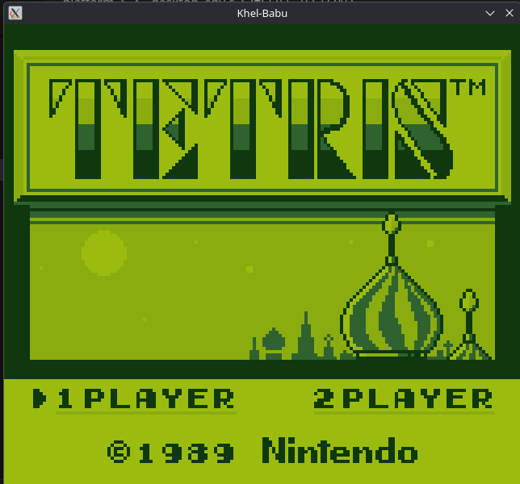
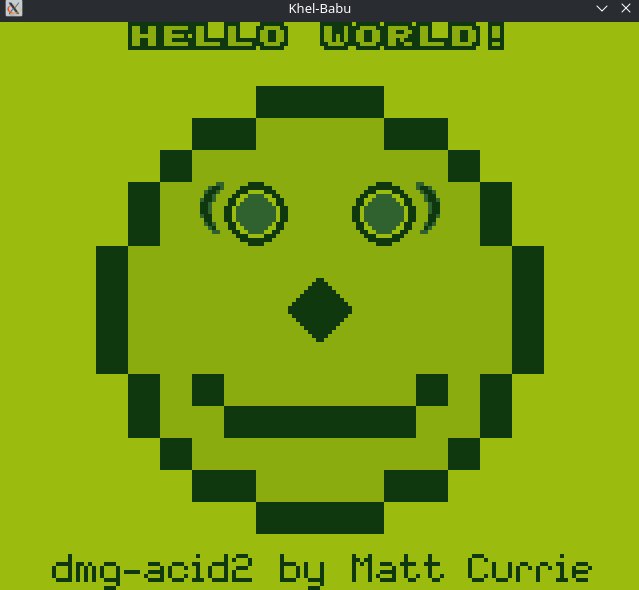
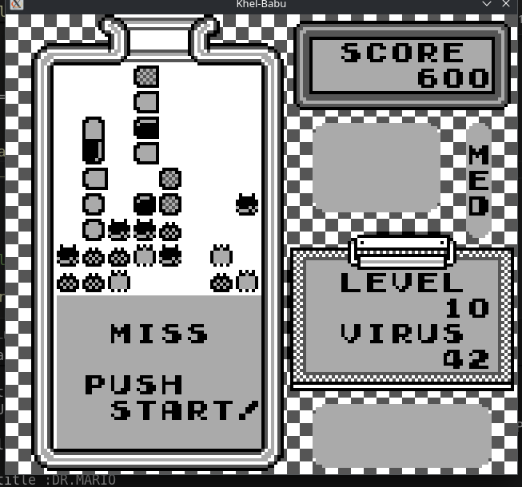

# khel-babu

This is my attempt to completely create a game boy emulator (hardware and software) using esp32

I will post updates below, including what I am working on, TODOs, bugs, etc while this is during the 
development phase.

You can contribute by contacting me through my FB profile in github
or through e-mail: dareludum@gmail.com
> Thank You

- I did the FF41 in mem read, write and inside the PPU idk what is that
- I didn't trigger interrupt when joypad is clicked.

## Checkpoint #3
THe ppu is almost complete now. The DMG acid test is passed with a clear face and its really cool. I will working on the controls now, tetris also goes to the menu which is really good 

This is the passed, dmg acid test

## Checkpoint #2
The ppu is made to be bare minimum for now. I am having a really hard time with timers, interrupts and PPU but i have got all of the blarrg test to pass (except 2), some games that don't rely on cycle accurate timings show up and it feels cool to look at them, will be taking a break.(don't know for how long). This is DR.mario on Khel-Babu

## Checkpoint #1
The CPU is almost done, I haven't added support for every Opcode yet but for most of the non-prefixed and prefixed ones are added and more will be added later.
I am taking a break because CPU took a awful lot of time. I will be refactoring the cpu code througout this week and maybe will start workig on the PPU
I have implemented DEBUG outputs and loggings which can be turned on or off as needed.
CPU isn't fully optimized but 100000000 took 6 seconsd with -O3 flag so i think its okay
I couldva used switch case ladder instead of function pointer but i am living with this.
This much for today meet you at PPU.

# References That I am currently Using
https://gbdev.io/pandocs/Memory_Map.html
https://meganesu.github.io/generate-gb-opcodes/
https://github.com/robert/gameboy-doctor
http://blog.kevtris.org/blogfiles/Nitty%20Gritty%20Gameboy%20VRAM%20Timing.txt
https://github.com/Ashiepaws/GBEDG/blob/master/timers/index.md